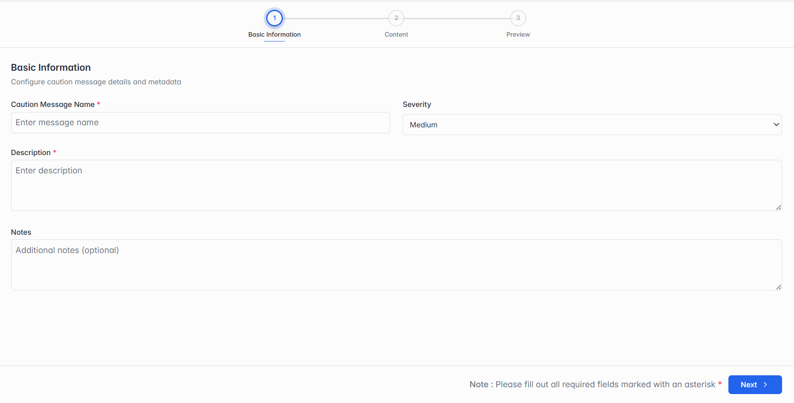

### Adding a New Caution

Click Add Single Caution. You'll fill in 3 steps, and can click Previous at any point to go back and fix something.

### Step 1 of 3 — Basic Information

_Step 1: Basic Information._

| Field                | What it means                                                 |
| -------------------- | ------------------------------------------------------------- |
| Caution Message Name | A name for this caution, so you can recognize it in the list. |
| Severity             | How serious this caution is: Low, Medium or High.             |
| Description          | A short explanation of what this caution is warning about.    |
| Notes                | Optional — any additional notes for your own reference.       |
