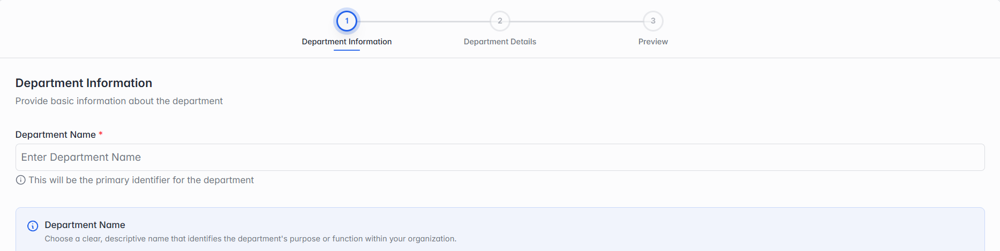

### Edit Department

Click Edit Department to update an existing department. It's a 2-step form that covers the same ground as Adding a New Department (section 3.4), minus the preview step. Unlike the Add wizard, the Update Department button appears at the bottom of every step here, not just the last one — you can save your changes as soon as you're done, without stepping through the rest.

**Step 1 of 2 — Department Information**

*Step 1: Department Information — the Edit screen looks the same as the Add wizard's step.*

Same field as Department Information in section 3.4 — Department Name.
