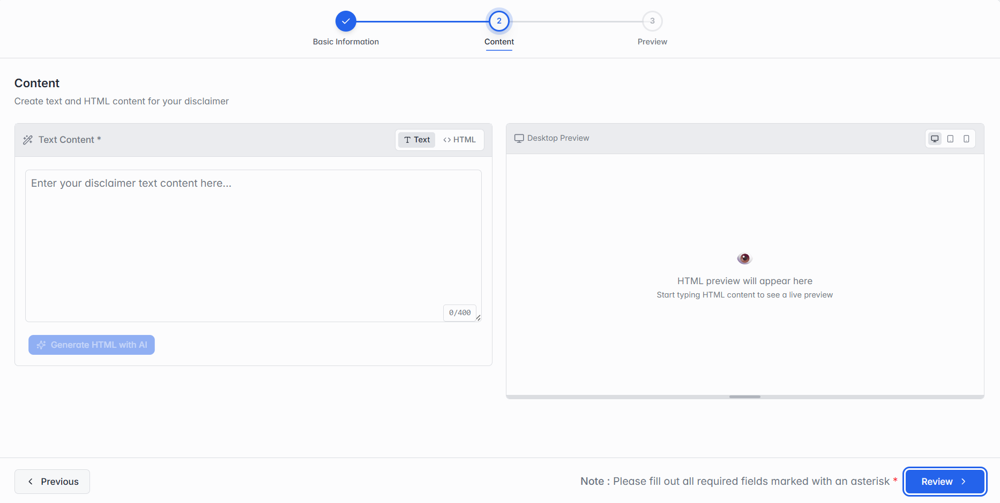

### Step 2 of 3 — Content

_Step 2: Content._

This is the actual disclaimer text that gets attached to mail. Switch between the Text and HTML tabs to choose how you write it, and use the Desktop Preview panel on the right to see how it will look.

| Field                 | What it means                                                                            |
| --------------------- | ---------------------------------------------------------------------------------------- |
| Text Content          | Write the disclaimer as plain text, up to 400 characters.                                |
| HTML                  | Switch to this tab to write the disclaimer as HTML instead, for more formatting control. |
| Generate HTML with AI | Let the panel generate HTML content for you instead of writing it by hand.               |
