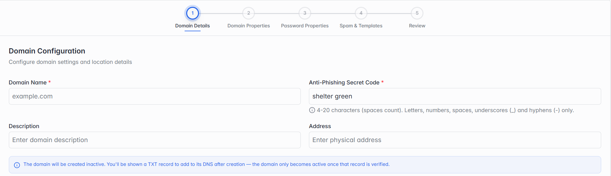

## 4.4 Adding a New Domain

Click Add Single Domain. You'll fill in 5 steps, and can click Previous at any point to go back and fix something.

### Step 1 of 5 — Domain Details

*Step 1: Domain Details.*

| Field | What it means |
| --- | --- |
| Domain Name | The domain itself, e.g. "example.com". |
| Anti-Phishing Secret Code | A short phrase shown back to your users inside the panel so they can tell a real email from a fake one. Must be 4-20 characters — letters, numbers, spaces, underscores (_) and hyphens (-) only. |
| Description | Optional — a short note about this domain. |
| Address | Optional — a physical address associated with this domain. |

> **Note:** The domain is created inactive. You'll be shown a TXT record to add to its DNS afterwards — it only becomes Active once that record is verified.
