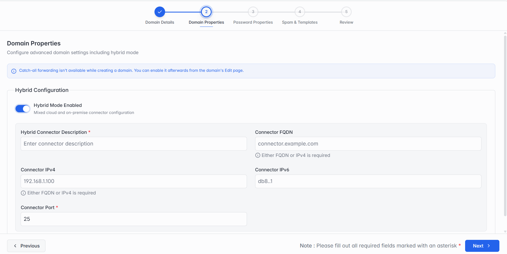

### Step 2 of 5 — Domain Properties

*Step 2: Domain Properties, with Hybrid Mode turned on.*

Hybrid Mode is off by default, which means the domain works entirely in the cloud with nothing else to configure here. Turn on Hybrid Mode Enabled if this domain also uses an on-premise mail server, and fill in:

| Field | What it means |
| --- | --- |
| Hybrid Connector Description | A short label for this connector, so you can recognize it later. |
| Connector FQDN / Connector IPv4 | The address of your on-premise mail server — either its domain name (FQDN) or its IPv4 address. At least one of the two is required. |
| Connector IPv6 | Optional — the server's IPv6 address, if it has one. |
| Connector Port | The port your on-premise server listens on for mail (typically 25). |

> **Note:** Catch-all forwarding isn't available while creating a domain — you can turn it on afterwards from the domain's Edit page.
