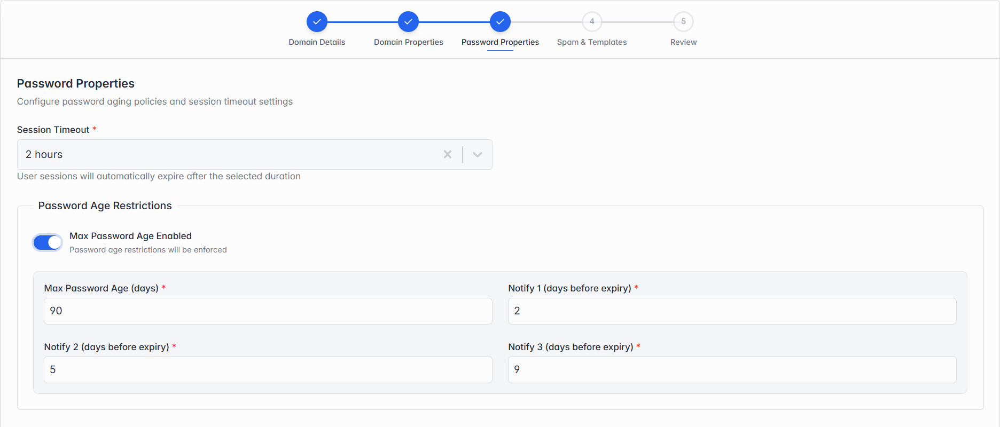

### Step 3 of 5 — Password Properties

*Step 3: Password Properties, with Max Password Age turned on.*

| Field | What it means |
| --- | --- |
| Session Timeout | How long a user can stay signed in before being automatically logged out. |
| Max Password Age Enabled | Turn this on to force passwords to be changed after a set number of days. Leave it off (the default) and passwords never expire. |
| Max Password Age (days) | Only shown when the toggle above is on — how many days a password stays valid before it must be changed. |
| Notify 1 / 2 / 3 (days before expiry) | Only shown when the toggle above is on — three reminders sent to the user counting down to their password's expiry, e.g. at 9, 5 and 2 days before. |
