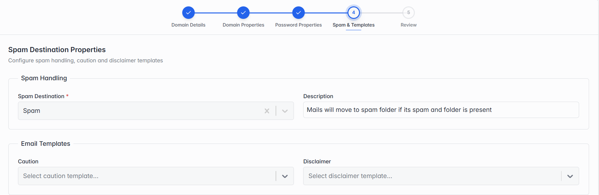

### Step 4 of 5 — Spam & Templates

*Step 4: Spam & Templates.*

| Field | What it means |
| --- | --- |
| Spam Destination | Where suspected spam email is sent, e.g. a Spam folder. |
| Description | A note describing what this spam setting does. |
| Caution / Disclaimer | Optional — pick a ready-made template to automatically warn users about suspicious mail, or add a disclaimer to outgoing mail. |
