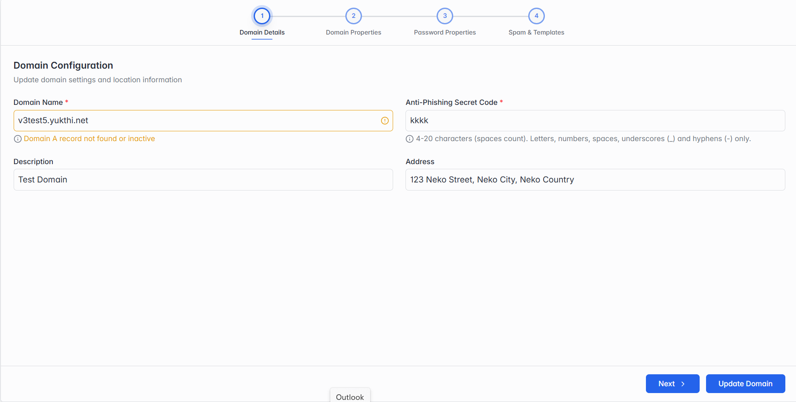

### Edit Domain

Click Edit Domain to update an existing domain. It's a 4-step form that covers much the same ground as Adding a New Domain (section 4.4), with a couple of differences called out below. Unlike the Add wizard, the Update Domain button appears at the bottom of every step here, not just the last one — you can save your changes as soon as you're done, without stepping through the rest.

**Step 1 of 4 — Domain Configuration.**

*Step 1: Domain Configuration.*

The same fields as Domain Details in section 4.4 — Domain Name, Anti-Phishing Secret Code, Description and Address.

> **Note:** You can ignore a "Domain A record not found or inactive" warning here — it just means this particular domain's DNS isn't fully set up, not a problem with the Edit page itself.
