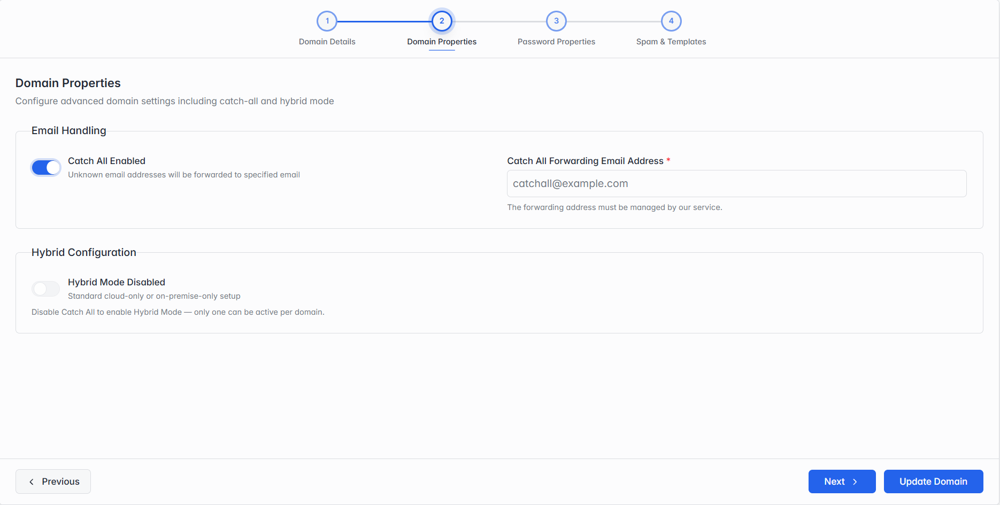
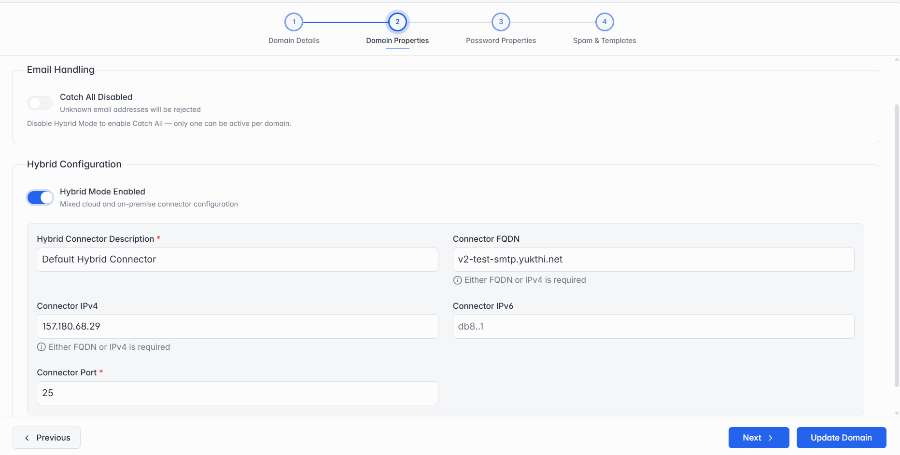

**Step 2 of 4 — Domain Properties.**

This step adds two settings that only make sense for a domain that already exists — Catch-All and Hybrid Mode. Only one of the two can be active at a time; turning one on automatically turns the other off.

| Field       | What it means                                                                                                                                                                                                                                                                      |
| ----------- | ---------------------------------------------------------------------------------------------------------------------------------------------------------------------------------------------------------------------------------------------------------------------------------- |
| Catch-All   | When enabled, mail sent to an address that doesn't exist on this domain is forwarded to one email address you specify, instead of being rejected. Turned off, unknown addresses are rejected.                                                                                      |
| Hybrid Mode | When enabled, this domain splits its mail handling between the cloud and an on-premise mail server you specify — the same Connector Description, FQDN/IPv4, IPv6 and Port fields covered in section 4.4's Step 2. Turned off, it's a standard cloud-only or on-premise-only setup. |

_Step 2 with Catch-All turned on._

_Step 2 with Hybrid Mode turned on instead._

> **Note:** Catch-All and Hybrid Mode are mutually exclusive — turning either one on turns the other off, since a domain can't run both setups at once.
