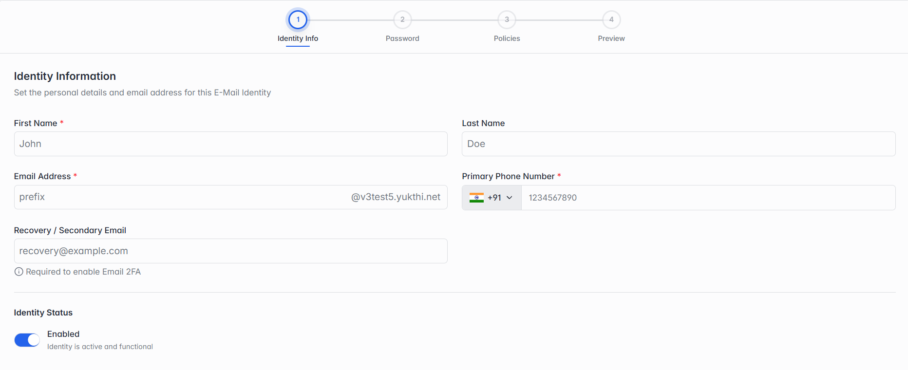

### 4.5.4 Adding a New Identity

Click Add Single. You'll fill in 4 steps, and can click Previous at any point to go back and fix something.

### Step 1 of 4 — Identity Info

*Step 1: Identity Info.*

| Field | What it means |
| --- | --- |
| First Name / Last Name | The person's name. First Name is required. |
| Email Address | Type the part before the @ — the domain you selected is added automatically. |
| Primary Phone Number | Pick the correct country code, then type the number. Required. |
| Recovery / Secondary Email | Optional — but required if you plan to turn on Email 2FA in Step 2. |
| Identity Status | Turn this on to make the identity active and usable right away. |
