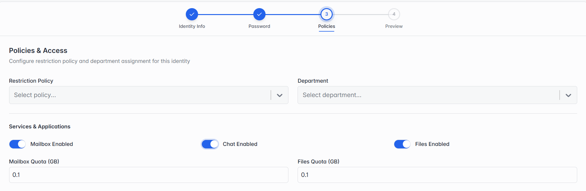

### Step 3 of 4 — Policies & Access

_Step 3: Policies & Access — choosing a Restriction Policy._

| Field              | What it means                                                                                                                              |
| ------------------ | ------------------------------------------------------------------------------------------------------------------------------------------ |
| Restriction Policy | Optional — pick a ready-made policy from the dropdown to control what mail this identity can send or receive, e.g. a stricter spam filter. |
| Department         | Optional — pick the department this identity belongs to, from the dropdown.                                                                |

_Step 3: Services & Applications._

Further down, Services & Applications lets you turn Mailbox, Chat and Files on or off individually for this identity, and set their storage quotas:

| Field                                 | What it means                                                                                                                     |
| ------------------------------------- | --------------------------------------------------------------------------------------------------------------------------------- |
| Mailbox Enabled                       | Turns on email for this identity.                                                                                                 |
| Chat Enabled                          | Turns on chat for this identity.                                                                                                  |
| Files Enabled                         | Turns on file storage for this identity.                                                                                          |
| Mailbox Quota (GB) / Files Quota (GB) | How much storage space (in GB) this identity gets for Mailbox and Files. Shown only when the matching service above is turned on. |
