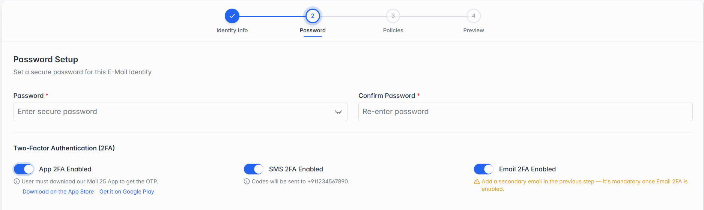

**Step 2 of 3 — Password.**

*Step 2: Password — the Edit screen looks the same, except the password fields are optional here.*

The same fields as Password in section 4.5.4's Step 2 — App 2FA Enabled, SMS 2FA Enabled and Email 2FA Enabled — with one difference:

| Field | What it means |
| --- | --- |
| New Password / Confirm Password | Optional — leave both boxes blank to keep the identity's current password. Fill them in (matching) only if you want to change it. |
