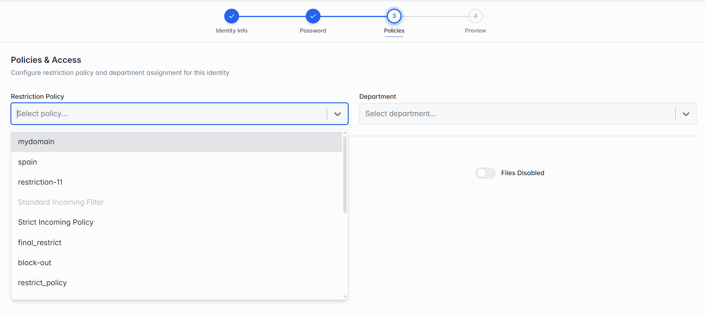

**Step 3 of 3 — Policies & Access.**

_Step 3: Policies & Access._

The same Restriction Policy and Department fields as section 4.5.4's Step 3.

> **Note:** The Services & Applications section (Mailbox / Chat / Files, and their quotas) shown when adding an identity isn't available here — those are set once when the identity is created and aren't editable from this screen afterwards.
