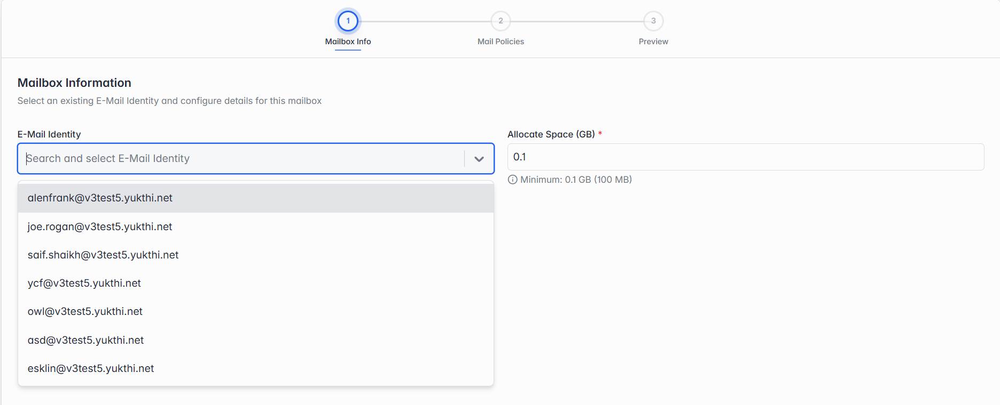

## 5.4 Adding a New Mailbox

Click Add Single Mailbox. You'll fill in 3 steps, and can click Previous at any point to go back and fix something.

### Step 1 of 3 — Mailbox Info

*Step 1: Mailbox Info.*

| Field | What it means |
| --- | --- |
| E-Mail Identity | Pick which existing identity this mailbox belongs to, from the dropdown. Only identities that belong to the domain currently selected at the top right are shown here — so make sure that's the same domain the identity was created under. An identity must already exist before you can create a mailbox for it — see section 4.5. |
| Allocate Space (GB) | How much storage space this mailbox gets. There's a minimum of 0.1 GB (100 MB). |
