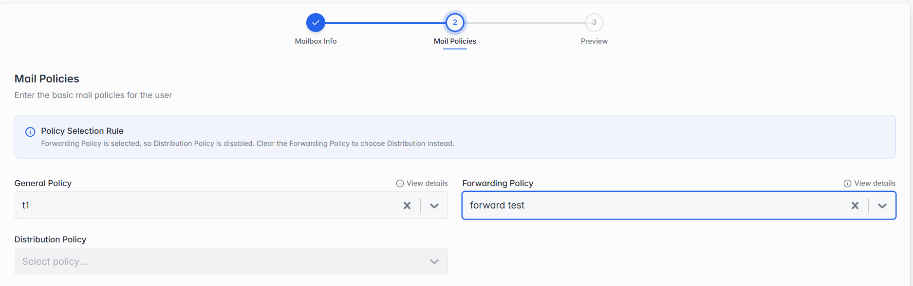

### Edit Mailbox

Click Edit Mailbox to update an existing mailbox. Unlike Adding a New Mailbox (section 5.4), which is a 3-step wizard, Edit Mailbox is a single step — the mailbox's identity and storage allocation are fixed once created (use Manage Quota, section 5.2, to change storage instead), so only its mail policies can be changed here. The Update Mailbox button appears directly below this one step.

**Step 1 of 1 — Mail Policies.**

*Mail Policies — the Edit screen looks the same as Step 2 of Adding a New Mailbox.*

The same fields as Mail Policies in section 5.4's Step 2 — General Policy, Forwarding Policy and Distribution Policy. Everything on this step is optional.

> **Note:** You can't select both Forwarding Policy and Distribution Policy. Picking a Forwarding Policy automatically clears Distribution Policy, and vice versa — to use one instead of the other, clear the current selection first.
