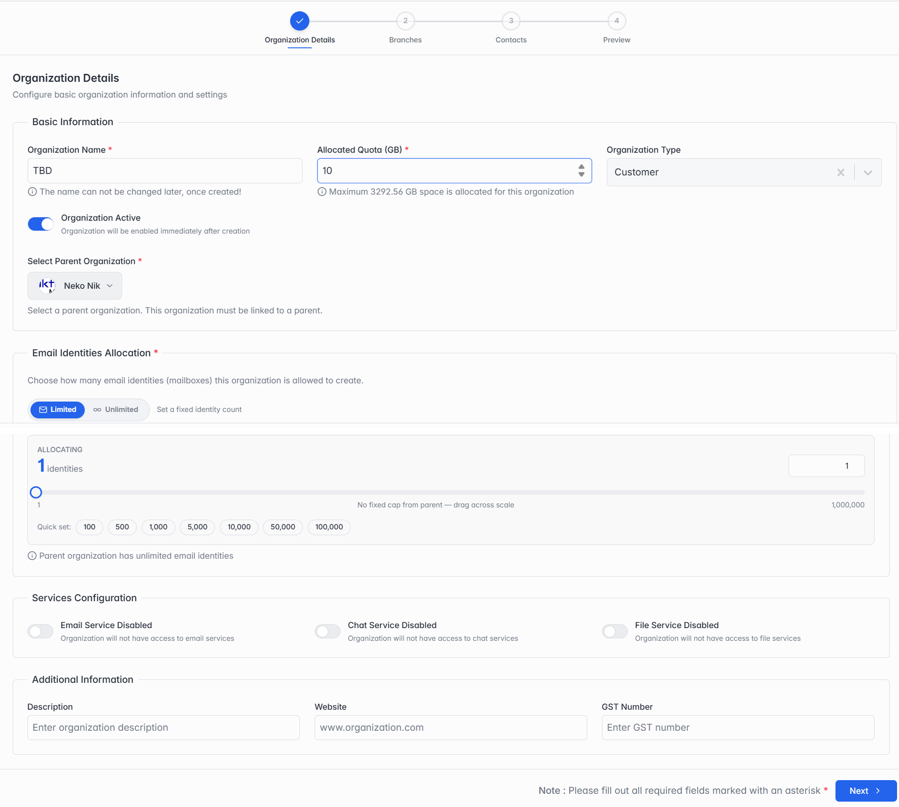

## 2.4 Adding a New Organization

Click + Add Organization. You'll fill in 4 short steps. You can always click Previous to go back and fix something before you finish.

### Step 1 of 4 — Organization Details

*Step 1: Organization Details.*

| Field | What it means |
| --- | --- |
| Organization Name | Type the company's name here. Important: once saved, the name cannot be changed later — so check the spelling before moving on. |
| Allocated Quota (GB) | The total storage space this organization is allowed to use, in GB (for their mail, chat and files together). The small note under this box tells you the maximum you're allowed to give right now. |
| Organization Type | What kind of organization this is: choose Customer for a regular customer using your service, Reseller if they sell your service on to their own customers, or Partner for another kind of business partner. |
| Organization Active | Turn this ON to make the organization work immediately after you create it. Turn it OFF if you want to set it up now but switch it on later. |
| Select Parent Organization | If this organization sits under a bigger one (for example, it's a customer of one of your resellers), pick that bigger organization here. Otherwise, you can leave this as is. |
| Email Identities Allocation | How many identities this organization is allowed to create (a mailbox is added on top of an identity, not counted as a separate one). Choose Limited and type a number (or use the slider/quick-set buttons), or choose Unlimited for no limit. |
| Services Configuration | Turn on whichever of Email, Chat and File Service this organization should be able to use. You'll see them summarized again in Step 4. |
| Additional Information | Optional — a short Description, the organization's Website, and its GST Number, if you'd like to keep these on file. |

> **Note:** Name fields throughout this wizard (Organization Name, Branch Name, and so on) only accept letters, numbers, spaces, hyphens (-) and underscores (_) — other special characters aren't allowed.
